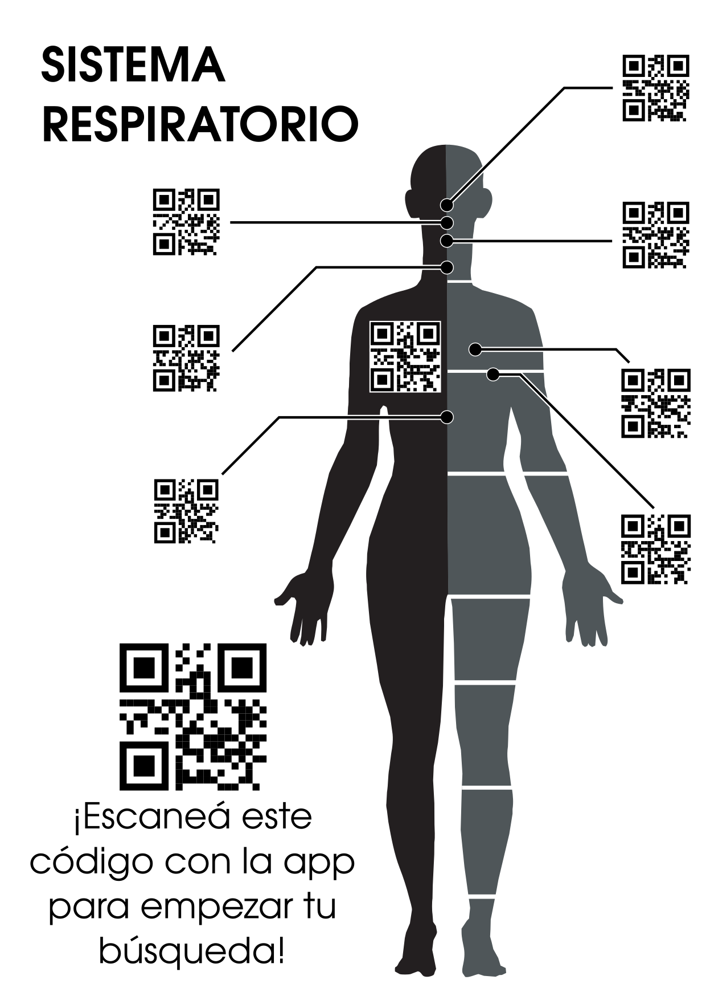
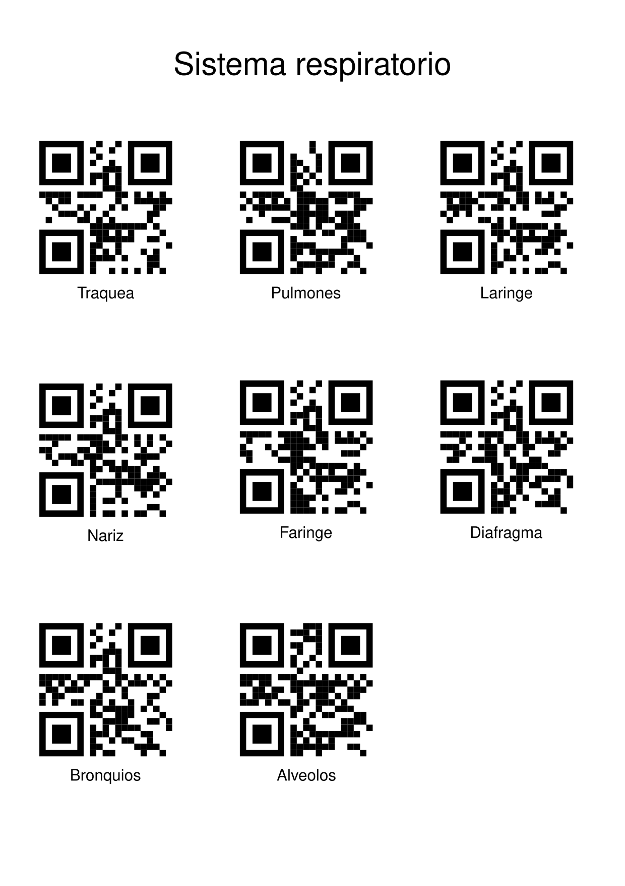

# qr-sistemas-cuerpo

## Instrucciones

1. Ingresar a la app en https://renecura.github.io/qr-sistemas-cuerpo/ y permitir el uso de la cámara
1. Escanear el código grande en la esquina inferior izquierda para establecer el sistema 

1. Escanear el código correspondiente al órgano 

1. Escanear el código en la posición correcta del órgano
1. Listo!
 
